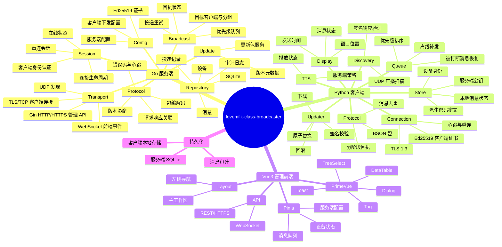

# class-broadcaster
教师电脑为服务端, 班级大屏为客户端的班级叫号系统

服务端先开启, 客户端通过流程扫描并连接到服务端, 并可选择自动连接

客户端通过 TLS 长连接等待服务端发送叫号或其他消息, 客户端通过服务端发送的选项决定是否使用离线 TTS 朗读, 消息弹出的窗口位置

客户端使用 Python + PySide6, 在 Windows 上使用注册表配置自启动, 并使用 Pyinstaller 打包; 服务端使用 Golang 编写高性能服务端, 并提供 Vue3 + TS + Pinia 等的现代化前端

## Global
项目名称为 `lovemilk-class-broadcaster`, ident 为 `MKCB`, 亦作为数据包的魔术头

## Flow
### 自动连接
1. 客户端发送广播发送 req-detect
2. 服务端返回 resp-detect
3. 客户端显示服务端 pubkey 的 sha256 并让用户确认, 同时客户端保存: 服务端 IP 和 子网, 服务端 pubkey 和 服务端协议版本. 若用户同意连接则向服务端 (IP) 发送 req-connect
4. 服务端向客户端发送 resp-connect

---

下次连接时, 客户端优先请求服务端 IP 并校验 pubkey, 校验不通过的向服务端的 IP/子网 广播 1. 并从新走流程, 找到服务端就更新本地存储的服务端 IP 和 子网, 若仍旧无法找到的, 则退回 1. 的全网广播流程, 仍旧无法找到提示无法连接服务端

### 手动连接
1. 用户填写服务端 IP 地址
2. 客户端向服务端发送 req-detect
3. 服务端返回 resp-detect
4. 客户端显示服务端 pubkey 的 sha256 并让用户确认, 同时客户端保存: 服务端 IP 和 子网, 服务端 pubkey 和 服务端协议版本. 若用户同意连接则向服务端 (IP) 发送 req-connect
5. 服务端向客户端发送 resp-connect

---

下次连接时, 客户端优先请求服务端 IP 并校验 pubkey, 校验不通过的并在添加服务端时勾选了 "自动在当前子网侦测服务端" 时向服务端的 IP/子网 广播 1. 并从新走流程, 找到服务端就更新本地存储的服务端 IP 和 子网, 若仍旧无法找到的并在添加服务端时勾选了 "自动在全局域网侦测服务端" 时 , 则退回 自动连接的 1. 的全网广播流程, 仍旧无法找到提示无法连接服务端; "自动在当前子网侦测服务端" "自动在全局域网侦测服务端" 为 Radio 单选

## Pocket
| byte range | desc |
| :-: | :- |
| `0x00-0x03` | 魔术头 `MKCB` 的 ASCII |
| `0x04` | 协议主版本 `uint8` |
| `0x05` | 协议次版本 `uint8` |
| `0x06-0x07` | 包类型 `uint16 BE` |
| `0x08-0x0B` | 包总长度（含头）`uint32 BE` |
| `0x0C-0x0D` | 包 Seq `uint16 BE` |
| `0x0E-0x0F` | 标志位 `uint16 BE` |
| `0x10-` | BSON Payload |

## Handshake

握手分为发现握手和业务握手两层：

1. 发现使用 UDP，允许广播；仅用于找到服务端和读取服务端身份，不承载叫号业务。
2. 业务连接使用 TCP + TLS，客户端通过证书公钥指纹（SPKI SHA-256）做 TOFU（首次信任）校验。后续连接必须匹配已保存指纹，不能只校验 IP。
3. `req-connect` 在 TLS 连接建立后发送。客户端携带当前配置 ID，首次连接使用 `null`；服务端返回会话 ID、协议版本、配置 snapshot 和心跳参数。
4. 服务端和客户端均使用 Ed25519 身份证书进行 TLS 1.3 双向认证，TLS 使用标准密钥交换和 AEAD 加密保护业务数据。
5. 服务端证书为自签名证书，身份以公钥指纹为准；证书至少包含服务端标识和有效期。证书轮换必须通过显式重新确认，不能静默覆盖本地信任记录。

### 配置 Snapshot

每份服务端配置生成一个 `config_id`，格式为 `<timestamp_ms>.<uint32>`：前半段是 Unix 毫秒时间戳的十进制表示，后半段是随机 4 BYTE 按 big-endian 解释后的无符号十进制整数。客户端将其作为字符串保存并回传；服务端解析时间戳用于 7 天有效期判断。

- 客户端在 `req-connect` 中发送当前 `config_id` 或 `null`。
- ID 不一致、客户端没有 ID，或 ID 的签发时间距离当前超过默认 7 天时，服务端在握手响应中下发完整配置 snapshot。
- 每个连接绑定握手时的配置 snapshot。该连接内的心跳间隔、超时和重试参数固定使用此 snapshot，避免服务端和客户端因配置不一致而误判心跳超时。
- 前端可以手动重新发布配置。未勾选“立即更新”时，新配置不会单独广播，而是在下一条消息事件中携带 `as_default=true` 与默认显示位置/显示比率，客户端先应用该默认值再解析消息，避免两个数据包的竞争；勾选后服务端立即发送配置变更事件。
- 客户端配置校验失败时继续使用上一份有效 snapshot，并回报错误。

协议和管理 API 对外时间字段统一使用 Unix 毫秒整数（UTC epoch milliseconds），包括消息创建/过期时间、配置签发时间和设备在线时间。客户端按目标时区格式化展示，不传输带本地时区的日期字符串。

### 分层架构



服务端是单个 Go 进程，内部按模块拆分：

- `transport`: UDP 发现、TCP/TLS 监听、Gin HTTP API、WebSocket（前端实时状态）。
- `protocol`: 包编解码、版本协商、请求/响应关联、错误码、心跳。
- `session`: 客户端连接生命周期、设备认证、在线状态和重连。
- `broadcast`: 叫号消息生成、目标客户端选择、发送重试和幂等。
- `config`: 服务端配置和证书管理。
- `repository`: SQLite 访问，首版不引入独立数据库。
- `audit`: 管理操作和发送结果审计。
- `update`: 更新元数据读取和发布版本检查；实际替换由独立 updater 完成。

前端只调用服务端 HTTP API，不直接访问 SQLite 或客户端。叫号发送由服务端统一路由：前端提交一条带 `message_id` 的消息，服务端根据客户端标签/班级/屏幕分组投递，并通过 WebSocket 回报发送状态。

当前管理 API 的最小实现包括：`GET /healthz`、`GET /api/v1/health`、`POST/GET /api/v1/messages`、`POST/GET /api/v1/devices` 和 `GET/POST /api/v1/config`。设备批准接口接收 64 位小写十六进制 SHA-256 公钥指纹作为 `client_id`；服务端只保存指纹，不保存客户端证书或公钥。TLS 握手后服务端计算客户端证书 SPKI 的 SHA-256 并与信任列表比较，未知指纹收到 `client_not_approved` 错误。配置更新会生成新的 `config_id`；勾选立即更新时，服务端通过 `ConfigUpdate` 向现有连接发布 snapshot。

客户端内部拆分为 `discovery`、`connection`、`protocol`、`store`、`display`、`tts`、`updater` 七个模块。UI 线程不直接执行网络读写；网络线程将事件投递到 Qt signal/slot，断线重连采用指数退避并带抖动。

### 端口与传输

建议固定端口并写入配置：

| 传输 | 默认端口 | 用途 |
| --- | ---: | --- |
| UDP | 39001 | `req-detect`/`resp-detect`，支持定向广播和有限范围广播 |
| TCP/TLS | 39002 | 客户端业务长连接 |
| HTTP/HTTPS | 39003 | 管理 API、前端静态资源、WebSocket 升级 |

UDP 响应必须携带服务端 IP、TCP/API 端口、协议版本、设备名、公钥指纹和随机 `nonce`；客户端只把响应当作候选，不在 UDP 中发送敏感配置。全局局域网侦测应限制为用户明确开启的模式，并设置超时、速率限制和去重。

### 包格式

当前固定头为 16 字节，协议版本用于协商兼容性：

| byte range | desc |
| :-: | :- |
| `0x00-0x03` | 魔术头 `MKCB` |
| `0x04` | 协议主版本 `uint8` |
| `0x05` | 协议次版本 `uint8` |
| `0x06-0x07` | 包类型 `uint16 BE` |
| `0x08-0x0B` | 包总长度（含头）`uint32 BE` |
| `0x0C-0x0D` | 包 Seq `uint16 BE` |
| `0x0E-0x0F` | 标志位 `uint16 BE` |
| `0x10-` | BSON Payload |

TCP 读取必须先读满固定头，再按长度读取 payload；长度上限建议 1 MiB，超限立即断开。BSON 文档统一使用 `snake_case` 字段名。每个请求包含 `request_id`，业务消息包含全局唯一 `message_id`；服务端以 `message_id` 做幂等，客户端仅在进程内按 `(server_id, message_id)` 去重，不将去重记录持久化。客户端重启后允许因服务端重发而再次播报。

包类型按方向分段：`0x0001-0x00FF` 发现，`0x0100-0x01FF` 握手，`0x0200-0x02FF` 会话/心跳，`0x1000-0x10FF` 叫号业务，`0x7F00-0x7FFF` 错误。错误响应统一包含 `code`、`message`、`retryable`。

### 连接状态机

客户端状态：`STOPPED -> DISCOVERING -> CANDIDATE -> TRUST_CONFIRM -> CONNECTING -> ONLINE -> BACKOFF/SUSPEND_CHECK`。

  - `DISCOVERING` 先尝试已保存服务端地址，失败后使用 UDP IPv4 广播扫描服务端，且每阶段有独立超时。
- 发现到的公钥指纹与本地记录不一致时进入 `TRUST_CONFIRM`，不能自动替换。
- `ONLINE` 期间使用配置 snapshot 的 heartbeat 参数发送 ping；超时进入 `BACKOFF`，意外断开重连使用 `1,1,1,2,4,8,16,32,64,128` 秒，之后进入每 5 分钟 TCP 检测。
- 服务端正常关闭发送会话事件 `0x0203 server_shutdown`；客户端确认事件后进入 `SUSPEND_CHECK`，每 5 分钟检测服务端 TCP 端口，恢复后重新握手。
- 服务端重启或会话过期不改变信任记录，只重新执行 TLS 和 `req-connect`。

### 核心业务消息

叫号消息至少包含：`message_id`、`created_at`、`target`（设备 ID/分组）、`content`、`display`（窗口位置、单条显示比率）、`as_default`（是否先应用事件携带的默认显示配置）、`tts`（是否朗读、语速、音量）和 `expires_at`。服务端先落库再投递，客户端回执 `received`、`displayed`、`spoken` 或 `failed`。默认消息采用 at-least-once 投递，靠服务端幂等和客户端进程内 `(server_id, message_id)` 去重；不承诺 exactly-once。服务端从首次发送时间起计算 `ack_timeout_seconds`，默认 300 秒；该值随配置 snapshot 下发。超时仍未收到最终完成回执时允许重发，未启用 TTS 的消息以 `displayed/end` 为完成，启用 TTS 的消息以 `spoken/end` 为完成。

管理端可以撤回尚未过期的消息。撤回后消息状态为 `withdrawn`，服务端停止后续投递，并通过 `message_withdraw` 事件通知已发送过消息的在线客户端。客户端收到事件后，即使消息已经部分或全部显示，也必须停止后续朗读/显示并向用户提示“消息已撤回”；服务端保存撤回 warning 和原投递回执。撤回操作使用 `POST /api/v1/messages/{message_id}/withdraw`，允许在 `pending`、`sent` 或已有 `received`/`displayed`/`spoken` 回执时执行。

客户端离线时，服务端只保留对应的 `pending` 投递记录，不执行网络发送。消息默认从创建时间起保留 24 小时；客户端在有效期内上线后补发，超过 `expires_at` 后直接丢弃未完成投递并标记 `expired`。消息与投递状态在服务端工作目录 `data/server.db` 的 SQLite 数据库内持久化，重启后恢复有效期内的待投递消息。消息及关联投递记录从创建时间起保留 48 小时，之后清理；过期丢弃和撤回 warning 与投递状态一同保存，并通过管理事件通知前端。

### TTS 与显示

客户端 TTS 完全离线运行，不使用 `gTTS` 或任何云端语音服务。首选 Windows 10 本地 SAPI 5 中文语音；客户端安装包同时提供 Piper 中文模型作为离线 fallback。

首次启动、首次收到 TTS 消息，或服务端 TTS 配置/本地语音版本发生变化时，客户端按 `SAPI zh-CN -> Piper` 顺序探测并缓存成功结果。缓存至少包含引擎、voice/model 标识、版本指纹、探测时间和状态。后续优先使用上次成功的引擎；若运行时启动失败或朗读中途失败，立即切换 fallback，并从头重新朗读当前消息。两个引擎都失败时仍显示消息，回报 `spoken=failed` 和具体错误码。

显示和 TTS 使用同一个客户端播放调度器：消息显示后立即开始 TTS，高优先级消息到达时停止当前朗读并切换新消息，被打断消息回到原优先级队列。消息主体保持单行，超长文本向左滚动；默认显示时长按 ASCII/标点 1 单位、中文 1.5 单位乘显示比率计算，比率为 0 时显示整行手动关闭按钮。显示最短时长仍为 `max(total / 4, 1)` 秒，其中 `total` 为当前 TTS 的预计总时长。

语音内容使用结构化 BSON 节点，不让客户端解析任意 XML 或脚本。首版只支持普通文本、重复和停顿三种节点：重复朗读使用 `{type: "repeat", count: 3, children: [...]}`，停顿使用 `{type: "pause", duration_ms: 800}`。客户端将节点编译为 SAPI 或 Piper 可接受的纯文本/语音片段；服务端保存原始语义结构，客户端只做安全清理和标点处理。

### 持久化

管理控制台的消息队列将客户端回执拆分为“已接收”和“已显示完成”两列，并显示单条消息的显示位置、显示时长和 TTS 状态。消息列表支持内容/客户端、状态、位置和 TTS 筛选；服务端 JSONL 日志表使用 PrimeVue DataTable 分页。配置表单维护已发布快照，切换页面、使用页面刷新或浏览器刷新前若存在未发布修改，使用 PrimeVue ConfirmDialog 选择发布或丢弃。

分页大小是服务端共享偏好，允许值为 10、15、20、25、30、50、100、200，默认 25，选择后写入 `data/server.db` 的 `server_preferences` 表；所有 DataTable 分页器位于表格顶部。服务端日志页面先渲染筛选和表格骨架，再在下一帧加载 JSONL，避免进入页面时同步解析造成卡顿。前端 API 请求通过 DataTable loading、按钮 loading 或 Skeleton 反馈请求状态。

管理端的“关闭服务端”操作通过 `POST /api/v1/shutdown` 触发受控关闭：服务端先向在线客户端发送 `SERVER_SHUTDOWN`，客户端进入维护重连路径，然后关闭管理 API 和监听器。系统 signal 使用相同的关闭事件路径；连接异常没有该事件时仍按意外断开处理。

服务端消息历史、投递状态、撤回记录、客户端注册表、管理偏好和配置 snapshot 均使用工作目录下的 SQLite `data/server.db` 持久化；当前版本不导入旧版 JSON 配置或设备文件。

服务端 SQLite 数据库默认位于工作目录 `data/server.db`，至少持久化消息、目标客户端、投递状态、创建/过期时间和撤回/过期 warning；服务启动时恢复 48 小时内仍有效的 pending 记录，按创建时间清理超过 48 小时的消息历史。建议表包括 `settings`、`devices`、`device_groups`、`messages`、`message_deliveries`、`message_events`、`config_snapshots`、`audit_logs` 和 `schema_migrations`。客户端本地使用 JSON 原子文件保存服务端 endpoint、服务端 SHA-256 指纹和当前 `config_id`；不保存消息正文、回执或去重记录，消息状态只由服务端维护。

客户端 Ed25519 私钥保存为安装目录下的密文文件。加密密码按约定由安装时间戳、设备 ID、CPUID 和固定 salt 派生；派生密码只在进程内存中短暂存在，不单独落盘。启动时重新派生密码并解密私钥，失败时将设备标记为需要重新注册。安装目录位于自启动安装目录下，以适配系统 C 盘重启还原环境。

#### 私钥派生与密文格式

推荐使用 `Argon2id` 派生私钥加密密钥，再使用 `AES-256-GCM` 加密 Ed25519 私钥：

```text
password = UTF-8(
  "MKCB-KDF-v1\0" ||
  install_timestamp_ms ||
  client_id_sha256 ||
  cpuid_canonical ||
  device_id_canonical
)

key = Argon2id(
  password,
  salt = random_16_bytes,
  memory = 64 MiB,
  iterations = 3,
  parallelism = 2,
  output_length = 32
)

ciphertext = AES-256-GCM(key, nonce = random_12_bytes, plaintext = private_key)
```

密文文件保存 `format_version`、KDF 参数、`install_timestamp_ms`、salt、nonce、ciphertext 和 GCM tag；salt 和 nonce 不属于秘密。字段使用固定字节序和长度编码，`cpuid_canonical` 取 CPUID 指令返回值的固定十六进制小写串，缺失时使用明确的空值标记，禁止依赖本地化字符串。启动时密码和派生 key 只保留在进程内存中，解密或使用完成后主动清零可写缓冲区。

该方案能让复制到另一台、硬件标识不同的设备无法直接解密；但安装时间戳、设备 ID 和 CPUID 都不是高熵秘密，若攻击者能复制密文并伪造这些输入，Argon2id 只能增加离线猜测成本，不能提供不可伪造的硬件绑定。

服务端为每个客户端连接保存配置 snapshot 标识和参数快照；配置更新可以只影响新连接，也可以由前端勾选后立即发送配置变更事件。客户端仅在校验成功后切换 snapshot，并以当前连接绑定的心跳参数判断超时。

### 更新与发布

更新包必须包含 `metadata.json`，至少字段：`component`（`client`/`updater`）、`version`、`platform`、`sha256`、`signature`、`release_url`。客户端只下载到临时目录，校验 HTTPS、签名和 SHA-256 后调用 updater；updater 校验 `component` 与目标路径，停止旧进程、原子替换、失败回滚并写入结果日志。服务端只提供版本元数据和文件，不在业务连接中直接推送可执行文件。

### 目录建议

```text
server/
  cmd/server/main.go
  internal/{transport,protocol,session,broadcast,config,repository,audit,update}/
  web/                 # Vue 构建产物或开发代理入口
client/
  app/                  # PySide6 UI 与应用编排
  core/{discovery,connection,protocol,store,display,tts}/
  updater/              # Go 独立 updater
frontend/
  src/{views,components,stores,api,router}/
  vite.config.ts
```

### 首阶段实现顺序

1. 先冻结协议常量、BSON schema、错误码和版本协商规则，并为 Go/Python 各写编解码测试。
2. 实现 Go TLS 服务、UDP 发现和 Python 客户端最小连接状态机。
3. 加入 SQLite、设备注册、心跳与叫号投递回执。
4. 实现管理 API 与前端设备/消息页面。
5. 最后接入 TTS、Windows 自启动和 updater，并做断网、重启、重复投递、证书变更测试。

当前代码已覆盖首阶段的协议编解码、UDP 发现签名、TLS 1.3 业务握手、配置 snapshot、设备批准、内存优先级队列、消息管理 API、SQLite 持久化和客户端离线身份加密存储。服务端默认使用工作目录下的 `data/server.db` 保存可恢复的消息快照、投递状态和 warning；启动时恢复有效的待投递记录，并清理超过 48 小时的历史。队列排序规则为优先级数字越小优先程度越高，同优先级按 FIFO。

## Update
客户端使用更新器 (Golang 单独的可执行文件以绕过 Windows 无法在文件被占用时替换文件) 从提供的更新的 URL 拿到新的可执行文件压缩包解压覆盖安装

同时我们在 Python 内实现更新器的更新 (注意: 我们通过更新压缩包内 metadata.json 区分 `["client", "updater"]` 的更新)

客户端 Python 环境固定为 Python 3.8，由 `uv` 创建和同步虚拟环境；依赖版本写入 `client/pyproject.toml`。数据模型使用 Pydantic，BSON 使用 PyMongo 官方 `bson` 实现，协议层不再维护自定义 BSON 编解码器。
