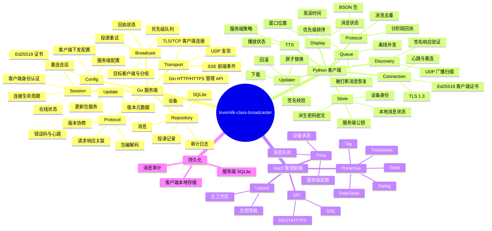

# class-broadcaster
教师电脑为服务端, 班级大屏为客户端的班级叫号系统

服务端先开启, 客户端通过流程扫描并连接到服务端, 并可选择自动连接

客户端通过 TLS 长连接等待服务端发送叫号或其他消息, 客户端通过服务端发送的选项决定是否使用离线 TTS 朗读, 消息弹出的窗口位置

客户端使用 CPython 3.11 + PySide6，在 Windows 上使用注册表配置自启动，并以官方 Windows embeddable runtime、Windows x64 wheels 和 Go GUI 启动器组成多文件包；服务端使用 Golang 编写高性能服务端，并提供 Vue3 + TS + Pinia 等的现代化前端。

## Global
项目名称为 `lovemilk-class-broadcaster`, ident 为 `MKCB`, 亦作为数据包的魔术头

## Flow
### 自动连接
1. 客户端发送广播发送 req-detect
2. 服务端返回 resp-detect
3. 客户端显示服务端 pubkey 的 sha256 并让用户确认, 同时客户端保存: 服务端 IP 和 子网, 服务端 pubkey 和 服务端协议版本. 若用户同意连接则向服务端 (IP) 发送 req-connect
4. 服务端向客户端发送 resp-connect

---

下次连接时, 客户端优先请求服务端 IP 并校验 pubkey, 校验不通过的向服务端的 IP/子网 广播 1. 并从新走流程, 找到服务端就更新本地存储的服务端 IP 和 子网, 若仍旧无法找到的, 则退回 1. 的全网广播流程, 仍旧无法找到提示无法连接服务端

### 手动连接
1. 用户填写服务端 IP 地址
2. 客户端向服务端发送 req-detect
3. 服务端返回 resp-detect
4. 客户端显示服务端 pubkey 的 sha256 并让用户确认, 同时客户端保存: 服务端 IP 和 子网, 服务端 pubkey 和 服务端协议版本. 若用户同意连接则向服务端 (IP) 发送 req-connect
5. 服务端向客户端发送 resp-connect

---

下次连接时, 客户端优先请求服务端 IP 并校验 pubkey, 校验不通过的并在添加服务端时勾选了 "自动在当前子网侦测服务端" 时向服务端的 IP/子网 广播 1. 并从新走流程, 找到服务端就更新本地存储的服务端 IP 和 子网, 若仍旧无法找到的并在添加服务端时勾选了 "自动在全局域网侦测服务端" 时 , 则退回 自动连接的 1. 的全网广播流程, 仍旧无法找到提示无法连接服务端; "自动在当前子网侦测服务端" "自动在全局域网侦测服务端" 为 Radio 单选

## Pocket
| byte range | desc |
| :-: | :- |
| `0x00-0x03` | 魔术头 `MKCB` 的 ASCII |
| `0x04` | 协议主版本 `uint8` |
| `0x05` | 协议次版本 `uint8` |
| `0x06-0x07` | 包类型 `uint16 BE` |
| `0x08-0x0B` | 包总长度（含头）`uint32 BE` |
| `0x0C-0x0D` | 包 Seq `uint16 BE` |
| `0x0E-0x0F` | 标志位 `uint16 BE` |
| `0x10-` | BSON Payload |

## Handshake

握手分为发现握手和业务握手两层：

1. 发现使用 UDP，允许广播；仅用于找到服务端和读取服务端身份，不承载叫号业务。
2. 业务连接使用 TCP + TLS，客户端通过证书公钥指纹（SPKI SHA-256）做 TOFU（首次信任）校验。后续连接必须匹配已保存指纹，不能只校验 IP。
3. `req-connect` 在 TLS 连接建立后发送。客户端携带当前配置 ID，首次连接使用 `null`；服务端返回会话 ID、协议版本、配置 snapshot 和心跳参数。
4. 服务端和客户端均使用 Ed25519 身份证书进行 TLS 1.3 双向认证，TLS 使用标准密钥交换和 AEAD 加密保护业务数据。
5. 服务端证书为自签名证书，身份以公钥指纹为准；证书至少包含服务端标识和有效期。证书轮换必须通过显式重新确认，不能静默覆盖本地信任记录。

### 配置 Snapshot

每份服务端配置生成一个 `config_id`，格式为 `<timestamp_ms>.<uint32>`：前半段是 Unix 毫秒时间戳的十进制表示，后半段是随机 4 BYTE 按 big-endian 解释后的无符号十进制整数。客户端将其作为字符串保存并回传；服务端解析时间戳用于 7 天有效期判断。

服务端配置 snapshot 持久化于工作目录 `data/server.db` 的 `config_snapshots` 表；首次启动生成默认值，之后启动先恢复最近快照再初始化运行时配置。默认监听策略为探测间隔 60 秒、试用时长 12 小时、失败重测等待 31 天、最大丢包率 10%、监听连接空闲超时 60 秒。管理端可调整探测间隔（1 秒至 1 小时）、试用时长（1 小时至 7 天）、重测等待（1 天至 365 天）、丢包阈值（0% 至 100%）和空闲超时（1 秒至 1 小时）；更新会生成新的 `config_id`，并同步到监听探测器与后续握手 snapshot。

- 客户端在 `req-connect` 中发送当前 `config_id` 或 `null`。
- ID 不一致、客户端没有 ID，或 ID 的签发时间距离当前超过默认 7 天时，服务端在握手响应中下发完整配置 snapshot。
- 每个连接绑定握手时的配置 snapshot。该连接内的心跳间隔、超时和重试参数固定使用此 snapshot，避免服务端和客户端因配置不一致而误判心跳超时。
- 前端可以手动重新发布配置。未勾选“立即更新”时，新配置不会单独广播，而是在下一条消息事件中携带 `as_default=true` 与默认显示位置/显示比率，客户端先应用该默认值再解析消息，避免两个数据包的竞争；勾选后服务端立即发送配置变更事件。
- 客户端配置校验失败时继续使用上一份有效 snapshot，并回报错误。

协议和管理 API 对外时间字段统一使用 Unix 毫秒整数（UTC epoch milliseconds），包括消息创建/过期时间、配置签发时间和设备在线时间。客户端按目标时区格式化展示，不传输带本地时区的日期字符串。

### 分层架构



服务端是单个 Go 进程，内部按模块拆分：

- `transport`: UDP 发现、TCP/TLS 监听、Gin HTTP API、SSE（前端实时状态）。
- `protocol`: 包编解码、版本协商、请求/响应关联、错误码、心跳。
- `session`: 客户端连接生命周期、设备认证、在线状态和重连。
- `broadcast`: 叫号消息生成、目标客户端选择、发送重试和幂等。
- `config`: 服务端配置和证书管理。
- `repository`: SQLite 访问，首版不引入独立数据库。
- `audit`: 管理操作和发送结果审计。
- `update`: 更新元数据读取和发布版本检查；实际替换由独立 updater 完成。

前端只调用服务端 HTTP API，不直接访问 SQLite 或客户端。叫号发送由服务端统一路由：前端提交一条带 `message_id` 的消息，服务端根据客户端标签/班级/屏幕分组投递，并通过 SSE 回报发送状态。

当前管理 API 包括：`GET /healthz`、`GET /api/v1/health`、`POST/GET /api/v1/messages`、`POST/GET /api/v1/devices`、`POST/GET /api/v1/updates`、`POST /api/v1/updates/publish`、`POST /api/v1/updates/:id/withdraw`、`GET /api/v1/updates/packages/:sha256` 和 `GET/POST /api/v1/config`。更新发布仅接受 multipart 上传的 `.tar.zst` 包，服务端存入 `data/updates/<manifest-sha256>.tar.zst` 并写 SQLite。设备批准接口接收 64 位小写十六进制 SHA-256 公钥指纹作为 `client_id`；服务端只保存指纹，不保存客户端证书或公钥。TLS 握手后服务端计算客户端证书 SPKI 的 SHA-256 并与信任列表比较，未知指纹收到 `client_not_approved` 错误。握手携带 `client_version`，服务端写入设备注册表供管理页面展示。配置更新会生成新的 `config_id`；勾选立即更新时，服务端通过 `ConfigUpdate` 向现有连接发布 snapshot。

客户端内部拆分为 `discovery`、`connection`、`protocol`、`store`、`display`、`tts`、`updater` 七个模块。UI 线程不直接执行网络读写；网络线程将事件投递到 Qt signal/slot，断线重连采用指数退避并带抖动。

### 端口与传输

建议固定端口并写入配置：

| 传输 | 默认端口 | 用途 |
| --- | ---: | --- |
| UDP | 39001 | `req-detect`/`resp-detect`，支持定向广播和有限范围广播 |
| TCP/TLS | 39002 | 客户端业务长连接；更新包专用短连接（`update_download`） |
| HTTP/HTTPS | 39003 | 管理 API、前端静态资源、SSE 事件流（**不含**客户端更新包下载） |

UDP 响应必须携带服务端 IP、TCP/API 端口、协议版本、设备名、公钥指纹和随机 `nonce`；客户端只把响应当作候选，不在 UDP 中发送敏感配置。全局局域网侦测应限制为用户明确开启的模式，并设置超时、速率限制和去重。

### 包格式

当前固定头为 16 字节，协议版本用于协商兼容性：

| byte range | desc |
| :-: | :- |
| `0x00-0x03` | 魔术头 `MKCB` |
| `0x04` | 协议主版本 `uint8` |
| `0x05` | 协议次版本 `uint8` |
| `0x06-0x07` | 包类型 `uint16 BE` |
| `0x08-0x0B` | 包总长度（含头）`uint32 BE` |
| `0x0C-0x0D` | 包 Seq `uint16 BE` |
| `0x0E-0x0F` | 标志位 `uint16 BE` |
| `0x10-` | BSON Payload |

TCP 读取必须先读满固定头，再按长度读取 payload；业务包最大 payload 为 256 MiB（兼容更新包直传），超限立即断开。BSON 文档统一使用 `snake_case` 字段名。每个请求包含 `request_id`，业务消息包含全局唯一 `message_id`；服务端以 `message_id` 做幂等，客户端仅在进程内按 `(server_id, message_id)` 去重，不将去重记录持久化。客户端重启后允许因服务端重发而再次播报。

包类型按方向分段：`0x0001-0x00FF` 发现，`0x0100-0x01FF` 握手，`0x0200-0x02FF` 会话/心跳，`0x1000-0x10FF` 叫号业务，`0x7F00-0x7FFF` 错误。错误响应统一包含 `code`、`message`、`retryable`。

客户端使用 `0x0205 ClientDisconnect` 接收管理端的主动断开命令。监听模式不自动重连，从模式每 5 分钟发起带 `reconnect_probe` 的握手，由服务端按客户端当前 `connection_mode` 返回 `connect_allowed`；设置页手动连接通过 `manual_connect` 请求，成功后重置退避，失败不改变原探测安排。该状态仅在运行期间保存，不写入本地服务器配置；启动仍会连接上次选中的服务器。客户端通过 `0x0206 ClientLog` 上传本地日志。客户端 `data/client.log` 与独立 Go updater 的 `data/updater.log` 统一为 JSON 行（字段 `time`/`level`/`msg`/`logger`/`source`；updater 为 `logger=mkcb.updater` 并含 version/build_date 身份），与服务端 `json.Valid` 解析一致。客户端更新重启并重新握手后，把未上报的 updater 日志经同一 `ClientLog` 通道推送，便于管理端排查无法更新的问题。连接补推不会把已上报较新 `client_version` 的客户端回滚到更旧包。日志缓存在服务端的独立有界客户端日志缓冲中，最多保留 1000 个客户端、每客户端 500 条；按客户端 SHA-256 ID 查询，不会从服务端进程日志中按 `client_id` 猜测客户端日志。每条上传记录限制 16 KiB。客户端日志 API 在服务端按日志时间倒序分页，默认后端页 100 条；前端使用共享页大小、页码跳转和 SSE 刷新当前页，与服务端日志分页一致。服务端在已知客户端主动断开（`ClientSessionEnd` 的 `user_exit`/`update`/`admin`）且不在线时，跳过监听探测累计，避免探测丢包被人为下线抬高。

客户端在主动退出前发送 `0x020A ClientSessionEnd`（BSON：`reason`=`user_exit`|`update`|`admin`，可选 `detail`）。服务端写入 `session_end_reason`/`session_end_at`：开发者面板 Exit → **人为终止**；更新切换 → **更新重启中**；管理端断开 → **管理端断开**。未收到 goodbye 的掉线进入 30 秒宽限期（UI 显示 **重连中**），30 秒内未重新上线则标记为 **意外终止**。重新握手成功会清除该状态。

“全部客户端”语义：
- 创建时若已有已批准客户端，目标集合固化为当时已批准指纹；创建时离线的客户端上线后仍会补收，创建后才批准的客户端不会追溯收到该消息。
- 创建时若还没有任何已批准客户端，服务端保存内部通配目标 `*`（不写入真实投递行）；之后新客户端完成授权或连接时，在消息未过期前会动态加入该通配广播的投递目标。管理端仍将目标显示为“全部客户端”。

### 连接状态机与监听模式

客户端状态：`STOPPED -> DISCOVERING -> CANDIDATE -> TRUST_CONFIRM -> CONNECTING -> ONLINE -> BACKOFF/SUSPEND_CHECK`。

  - `DISCOVERING` 先尝试已保存服务端地址，失败后使用 UDP IPv4 广播扫描服务端，且每阶段有独立超时。
- 发现到的公钥指纹与本地记录不一致时进入 `TRUST_CONFIRM`，不能自动替换。
- `ONLINE` 期间使用配置 snapshot 的 heartbeat 参数发送 ping；超时进入 `BACKOFF`，意外断开重连使用 `1,1,1,2,4,8,16,32,64,128` 秒，之后进入每 5 分钟 TCP 检测。
- 服务端正常关闭发送会话事件 `0x0203 server_shutdown`；客户端确认事件后进入 `SUSPEND_CHECK`，每 5 分钟检测服务端 TCP 端口，恢复后重新握手。
- 服务端重启或会话过期不改变信任记录，只重新执行 TLS 和 `req-connect`。
- 客户端握手声明 `listener_mode` 与 `listener_port`，服务端将地址和能力写入 `devices` 表；连接模式由服务端为已授权客户端指定，客户端设置页仅显示策略并允许调整监听端口。
- 管理端可以在客户端编辑窗口将单个客户端强制设为 `auto`、`pull` 或 `listen`；强制值优先于握手上报值，并随 `devices.forced_mode` 持久化。
- `auto` 首次握手后进入 12 小时监听试用窗口，服务端每分钟发起 TLS PING 探测并累计发送数、接收数、丢包率和最小/最大/平均延迟。试用结束且丢包率不超过 10% 时标记“监听模式”并结束试用窗口，不会在后续握手中重复试用；否则回退“从模式”，并在默认 31 天后允许再次测试。强制 `listen`/`pull` 不执行自动切换。
- 监听测试只改变连接能力状态，业务消息仍以现有已认证长连接为权威链路；监听探测使用 TLS 加密连接，并在 `PING/PONG` payload 中交换双方 Ed25519 公钥 hash。服务端以随机 nonce 和自身公钥签名挑战，客户端先检查服务端 SPKI SHA-256 在信任列表内，再用客户端私钥签名回包；服务端按登记的客户端 hash 验证公钥和签名。监听探测不会替代业务长连接，也不依赖保存对方证书。

### 核心业务消息

叫号消息至少包含：`message_id`、`created_at`、`target`（设备 ID/分组）、`content`、`display`（窗口位置、单条显示比率）、`as_default`（是否先应用事件携带的默认显示配置）、`tts`（是否朗读、语速、音量）和 `expires_at`。服务端先落库再投递，客户端回执 `received`、`displayed`、`spoken` 或 `failed`。默认消息采用 at-least-once 投递，靠服务端幂等和客户端进程内 `(server_id, message_id)` 去重；不承诺 exactly-once。服务端从最近一次成功写出消息起计算 `ack_timeout_seconds`，默认 300 秒，可在管理配置中设为 1 秒至 7 天；超时仍未收到最终完成回执时，仅重发该消息尚未完成的客户端。未启用 TTS 的消息以 `displayed/end` 为完成，启用 TTS 的消息以 `spoken/end` 为完成。重复或乱序的 `received` 不回退已完成回执，也不重置发送计时。

管理端可以撤回尚未过期的消息。撤回后消息状态为 `withdrawn`，服务端停止后续投递，并通过 `message_withdraw` 事件通知已发送过消息的在线客户端。客户端收到事件后，即使消息已经部分或全部显示，也必须停止后续朗读/显示并向用户提示“消息已撤回”；服务端保存撤回 warning 和原投递回执。撤回操作使用 `POST /api/v1/messages/{message_id}/withdraw`，允许在 `pending`、`sent` 或已有 `received`/`displayed`/`spoken` 回执时执行。

客户端离线时，服务端只保留对应的 `pending` 投递记录，不执行网络发送。消息默认从创建时间起保留 24 小时（`message_ttl`，可配置）；客户端在有效期内上线后补发，超过 `expires_at` 后直接丢弃未完成投递并标记 `expired`。消息与投递状态在服务端工作目录 `data/server.db` 的 SQLite 数据库内持久化，重启后恢复有效期内的待投递消息。已完成/过期/撤回的消息历史以及空闲客户端设备记录从创建或最后可见时间起保留 **185 天**，之后由定时任务清理（启动时立即跑一次，之后约每 6 小时）；过期丢弃和撤回 warning 与投递状态一同保存，并通过管理事件通知前端。

### TTS 与显示

客户端 TTS 完全离线运行，不使用 `gTTS` 或任何云端语音服务。首选 Windows 10 本地 SAPI 5 中文语音；客户端安装包同时提供 Piper 中文模型作为离线 fallback。

首次启动、首次收到 TTS 消息，或服务端 TTS 配置/本地语音版本发生变化时，客户端按 `SAPI zh-CN -> Piper` 顺序探测并缓存成功结果。缓存至少包含引擎、voice/model 标识、版本指纹、探测时间和状态。后续优先使用上次成功的引擎；若运行时启动失败或朗读中途失败，立即切换 fallback，并从头重新朗读当前消息。两个引擎都失败时仍显示消息，回报 `spoken=failed` 和具体错误码。

显示和 TTS 使用同一个客户端播放调度器：消息显示后立即开始 TTS，高优先级消息到达时停止当前朗读并切换新消息，被打断消息回到原优先级队列。消息主体保持单行，超长文本在窗口内向左自动滚动；消息窗口最大宽度为所在屏幕可用宽度的 95%，文字左右各留 0.25rem（相对内容字号）边距，不得随全文撑破屏幕。默认显示时长按 ASCII/标点 1 单位、中文 1.5 单位乘显示比率计算，默认比率为 `0.4`，配置比率范围为 `0..120`，计算所得的自动显示时长（包含 TTS 最短时长）封顶 `120` 秒；比率为 0 时不自动关闭并显示整行手动关闭按钮。显示最短时长仍按 `max(total / 4, 1)` 秒计算，其中 `total` 为当前 TTS 的预计总时长，最终再受 120 秒上限约束。

语音内容使用结构化 BSON 节点，不让客户端解析任意 XML 或脚本。首版只支持普通文本、重复和停顿三种节点：重复朗读使用 `{type: "repeat", count: 3, children: [...]}`，停顿使用 `{type: "pause", duration_ms: 800}`。客户端将节点编译为 SAPI 或 Piper 可接受的纯文本/语音片段；服务端保存原始语义结构，客户端只做安全清理和标点处理。

### 持久化

管理控制台的消息队列将客户端回执拆分为“已接收”和“已显示完成”两列，并显示单条消息创建时解析出的实际显示位置、显示比率和 TTS 状态。消息列表顶部指标卡包含待投递、消息总数、**服务端连接 TLS 端口**与**前端 / API 端口**（由 `/api/v1/health` 返回实际监听端口）。消息列表支持内容/客户端、状态、位置和 TTS 筛选；状态和位置筛选默认不限制，选择后可用清除按钮恢复。客户端列表支持搜索、授权状态/在线状态/连接模式筛选与排序（默认按登记时间 `approved_at` 降序 + `client_id`，与服务端 `Registry.List` 一致；不按 `last_seen` 默认排序，避免心跳刷新打乱顺序）；服务端 JSONL 日志表使用 PrimeVue 表格与顶部二级分页控件。配置表单维护已发布快照，切换页面、使用页面刷新或浏览器刷新前若存在未发布修改，使用 PrimeVue ConfirmDialog 选择发布或丢弃。业务 Dialog（发送消息、更新、设备、日志、消息预览）使用右上角关闭按钮，避免底部“取消/关闭”被长内容挤出可视区；ConfirmDialog 仍保持不可点 X 关闭。

客户端管理表为已批准客户端提供断开连接操作（确认后发送 `ClientDisconnect`，停止客户端自动重连；服务端仍保留授权）和客户端本地日志查看 Dialog。客户端的 Loguru 记录通过业务连接上传，日志 Dialog 只读客户端独立日志缓冲并通过按客户端节流的 SSE 事件自动刷新，使用表格展示时间、级别、消息和结构化字段，加载过程显示 Skeleton；管理端自身日志仍由单独的服务端日志页展示。

“全部客户端”目标在有已批准客户端时按创建时集合固化；仅当创建时没有任何已批准客户端才保留通配 `*`，之后批准/连接的客户端可加入未过期通配广播。服务端先用当前配置的 `message_ttl` 计算 `expires_at`，显式传入的过期时间优先。语音节点在落库前按当前配置校验递归深度、重复展开上限和停顿时长。

未勾选“立即向现有连接发送配置变更”时，配置只更新服务端当前快照；现有连接不会在普通心跳中被动切换。下一条消息通过 `as_default=true` 携带默认显示位置/比率，客户端先把这些值设为新的全局默认，再解析并显示该消息；新连接或勾选立即更新的连接才收到 `ConfigUpdate`。

分页大小是服务端共享偏好，允许值为 10、15、20、25、30、50、100、200，默认 25，选择后写入 `data/server.db` 的 `server_preferences` 表。消息、客户端、服务端日志和客户端本地日志统一复用 PrimeVue `TablePagination` 控件（首页/上一页/页码/下一页/末页、跳转、每页条数和总数），并统一放在表格上方；消息和客户端表格由前端按共享页大小切片，日志仍使用相同控件驱动前后端两级分页。服务端日志 API 固定以后端页 100 条返回，指定值必须是共享分页档位时仍校验该档位；服务端日志由 JSONL handler 同时写入文件和最多 5000 行的内存环形缓冲，管理 API 分页、筛选只读取内存缓冲，不再请求时扫描日志文件。前端日志页面先渲染筛选和表格骨架，再在下一帧请求日志；前端日志在后端 100 条页内按共享页大小本地切分，跨后端页时按需合并相邻页，API 请求通过 DataTable loading、按钮 loading 或 Skeleton 反馈请求状态。

管理端的“关闭服务端”操作通过 `POST /api/v1/shutdown` 触发受控关闭：服务端先向在线客户端发送 `SERVER_SHUTDOWN`，客户端进入维护重连路径，然后关闭管理 API 和监听器。Ctrl+C / SIGTERM 不发送 `SERVER_SHUTDOWN`（客户端按意外断开退避），只做管理 API 的快速 teardown：`Shutdown` 超时后 `Close` 强制结束 SSE 长连接，避免 `context deadline exceeded` 拖慢退出。管理 API 使用 SSE（`GET /api/v1/events`）推送实时状态，不使用 WebSocket。服务端构建时把 `frontend/dist` 嵌入 `server/cmd/server/web`，管理 API 与前端由同一个 ELF 提供。

服务端消息历史、投递状态、撤回记录、客户端注册表、管理偏好和配置 snapshot 均使用工作目录下的 SQLite `data/server.db` 持久化；客户端注册表保留所有曾连接或手动登记的指纹，包括待确认、已批准和已取消授权的设备。取消授权会将状态设为 `revoked` 并断开在线连接，不删除身份、名称和设备记录；之后可对同一记录重新授权。未知客户端首次握手也会持久化为待确认，重启服务端后仍显示在列表中。当前版本不导入旧版 JSON 配置或设备文件。

服务端 SQLite 数据库默认位于工作目录 `data/server.db`，消息按一条消息一行写入 `messages`，目标和回执分别写入 `message_targets` 与 `message_deliveries`；撤回后仍保留累计完成回执于 `message_delivery_history`，前端据此显示已接收/已显示完成数量；每条回执的 `last_attempt_at` 记录最近一次成功写包的 Unix 毫秒时间，warning 写入 `store_warnings`；不把整个消息集合塞入单个 JSON 快照。服务端创建消息时使用持久化的单调 Unix 毫秒 `created_at` 作为历史顺序键，同一毫秒递增 1ms，UUID4 `message_id` 只做幂等和并列排序，`queue_seq` 不作为唯一标识或历史排序依据。服务启动时恢复 pending 记录；发送过但未完成的 `sent`/`received` 回执依据持久化发送时间，在超时后进入重传队列；已 `displayed`/`spoken` 的回执不会重发。所有重传仍受消息自身 TTL 限制；超过 **185 天** 的消息与客户端设备配置记录会清理。配置、设备和消息表共同位于该数据库；客户端本地使用 JSON 原子文件保存服务端 endpoint、服务端 SHA-256 指纹和当前 `config_id`，不保存消息正文、回执或去重记录。

客户端 Ed25519 私钥保存为安装目录下的密文文件。加密密码按约定由安装时间戳、设备 ID、CPUID 和固定 salt 派生；派生密码只在进程内存中短暂存在，不单独落盘。启动时重新派生密码并解密私钥，失败时将设备标记为需要重新注册。安装目录位于自启动安装目录下，以适配系统 C 盘重启还原环境。

#### 私钥派生与密文格式

推荐使用 `Argon2id` 派生私钥加密密钥，再使用 `AES-256-GCM` 加密 Ed25519 私钥：

```text
password = UTF-8(
  "MKCB-KDF-v1\0" ||
  install_timestamp_ms ||
  client_id_sha256 ||
  cpuid_canonical ||
  device_id_canonical
)

key = Argon2id(
  password,
  salt = random_16_bytes,
  memory = 64 MiB,
  iterations = 3,
  parallelism = 2,
  output_length = 32
)

ciphertext = AES-256-GCM(key, nonce = random_12_bytes, plaintext = private_key)
```

密文文件保存 `format_version`、KDF 参数、`install_timestamp_ms`、salt、nonce、ciphertext 和 GCM tag；salt 和 nonce 不属于秘密。字段使用固定字节序和长度编码，`cpuid_canonical` 取 CPUID 指令返回值的固定十六进制小写串，缺失时使用明确的空值标记，禁止依赖本地化字符串。启动时密码和派生 key 只保留在进程内存中，解密或使用完成后主动清零可写缓冲区。

该方案能让复制到另一台、硬件标识不同的设备无法直接解密；但安装时间戳、设备 ID 和 CPUID 都不是高熵秘密，若攻击者能复制密文并伪造这些输入，Argon2id 只能增加离线猜测成本，不能提供不可伪造的硬件绑定。

服务端为每个客户端连接保存配置 snapshot 标识和参数快照；配置更新可以只影响新连接，也可以由前端勾选后立即发送配置变更事件。客户端仅在校验成功后切换 snapshot，并以当前连接绑定的心跳参数判断超时。

### 更新与发布

更新包仅为服务端本地 `data/updates/<manifest-sha256>.tar.zst`（zstd level 3 包住的 tar）。顶层直接含 `metadata.json` 与安装文件。metadata 含 `components`（规范顺序 `updater` 先于 `client`）、兼容 `component`（`client`/`updater`/`bundle`）、`version`、`client_version`、`updater_version`、`platform`、`payload_format`、`sha256`（files-v1 清单摘要）；增量包另可含 `incremental=true` 与 `file_count`。`scripts/package_update.py` 支持相对上一构建缓存（`build/cache/client-package-base`）或上一绿色 `.zip` 的差量打包：只打入变更/新增文件；若新树删除了基线路径则自动回退全量（overlay 无法删文件）。绿色安装始终为全量 `.zip`。发布时服务端校验 zstd magic + tar、清单 SHA-256 与路径安全；在线目标收到 `UPDATE_AVAILABLE`（meta + 鉴权 `download_token` + `seq` + 可选 `force`），客户端对业务 TLS 端口 **新建**短连接（`ConnectReq.update_download` + `UpdateDownloadReq/Resp` 分块）拉取包，**不**使用管理 HTTP `39003`。下载进度按百分比里程碑记录（`>0%` / `25%` / `50%` / `75%` / `>99%`，日志含 `%=… speed=…MiB/s`）。`UPDATE_AVAILABLE` **不**写入握手 `ConnectResp`；业务会话建立后，若客户端 `last_seq` 落后于其适用的已发布更新（含发布时离线），服务端补推最高适用 seq；已上报 `client_version` ≥ 包内版本则不再补推（强制/非强制相同，避免同包重启循环）。`force=true` 时目标为全部已批准客户端。客户端校验通过后启动独立 Go updater（日志 `data/updater.log`）对安装目录做文件级覆盖（保留 `data/`，支持仅 updater 包与稀疏增量包）；组合包内容已含 updater 优先文件布局。

管理端“更新发布”只接受 `.tar.zst`，经 `POST /api/v1/updates/publish` 向已选客户端推送通知。服务端从包内 `metadata.json` 识别组件/版本/平台与清单摘要；前端不手填这些字段。不接受 `.zip` 上传，也不再二次重压。收到更新时客户端只写日志（不弹 Windows 托盘通知）。

业务包最大 payload 为 256 MiB，以容纳包含 CPython、Qt 和原生 `.pyd` 的客户端更新包；Go 与 Python 解码器使用相同上限。更新包仍在 TLS 连接内发送，并在写盘和解包前校验 metadata、清单摘要及安全路径。

### 目录建议

```text
server/
  cmd/server/main.go
  internal/{transport,protocol,session,broadcast,config,repository,audit,update}/
  web/                 # Vue 构建产物或开发代理入口
client/
  app/                  # PySide6 UI 与应用编排
  core/{discovery,connection,protocol,store,display,tts}/
  updater/              # Go 独立 updater
frontend/
  src/{views,components,stores,api,router}/
  vite.config.ts
```

### 首阶段实现顺序

1. 先冻结协议常量、BSON schema、错误码和版本协商规则，并为 Go/Python 各写编解码测试。
2. 实现 Go TLS 服务、UDP 发现和 Python 客户端最小连接状态机。
3. 加入 SQLite、设备注册、心跳与叫号投递回执。
4. 实现管理 API 与前端设备/消息页面。
5. 最后接入 TTS、Windows 自启动、监听能力探测和 updater，并做断网、重启、重复投递、证书变更及更新回滚测试。

当前代码已覆盖首阶段的协议编解码、UDP 发现签名、TLS 1.3 业务握手、配置 snapshot、设备批准、内存优先级队列、消息管理 API、SQLite 记录化持久化、客户端监听探测和客户端离线身份加密存储。服务端默认使用工作目录下的 `data/server.db` 保存可恢复的消息记录、目标、投递状态和 warning；启动时恢复有效的待投递消息，并清理超过 185 天的消息/设备历史。队列排序规则为优先级数字越小优先程度越高，同优先级按服务端 `created_at` FIFO，管理端历史按最新 `created_at` 在顶部。根目录 `version.json` 分别管理 `server` / `client` 版本（构建时投影到各组件 `version.json`，`build_date` 为本地时间戳）。根目录 `Makefile` 优先使用 Zig 构建 Linux arm64 服务端；找不到 Zig 时回退到纯 Go arm64 交叉构建。Go 同时构建 amd64 服务端、Windows updater 和 Windows GUI 启动器；Linux 构建器将官方 CPython 3.11 x64 embeddable runtime、PySide6 Essentials Windows wheels、原生 `.pyd` 与 `-O` 优化字节码组装成多文件客户端，不使用 PyInstaller。`scripts/package_update.py` 将 `metadata.json` 与安装文件打成更新包 `.tar.zst`（zstd level 3 直接包 tar），并生成 `files-v1` 清单摘要；有上一构建缓存或上一绿色 zip 时默认打增量（`PACKAGE_FULL=1` 可强制主包全量；`make client-full` / `CLIENT_FULL=1` 在增量主包之外再写一份 `*-windows-amd64-full.tar.zst`）。管理端发布只接受该格式。`scripts/package_client_zip.py` 另打绿色安装 `.zip`（始终全量，首次部署用）。客户端 Python updater 与独立 Go updater 读取 zstd+tar 后校验清单并覆盖安装。

## Update
客户端使用更新器 (Golang 单独的可执行文件以绕过 Windows 无法在文件被占用时替换文件) 从提供的更新的 URL 拿到新的可执行文件压缩包解压覆盖安装

同时我们在 Python 内实现更新器的更新 (注意: 我们通过更新压缩包内 metadata.json 区分 `["client", "updater"]` 的更新)

客户端开发和内嵌运行环境固定为 CPython 3.11；依赖版本写入 `client/pyproject.toml` 并由 `uv` 锁定。Linux 构建时 `uv --python-platform x86_64-pc-windows-msvc` 直接安装 Windows wheels，性能关键依赖使用原生 `.pyd`，项目与第三方 Python 源码预生成 `-O` 优化字节码。数据模型使用 Pydantic，BSON 使用 PyMongo 官方 `bson` 实现，协议层不再维护自定义 BSON 编解码器。

### Linux 服务端部署

服务端提供 `deploy/systemd/lovemilk-class-broadcaster-server.service` 作为 user-level systemd unit。`make server`（或 `make build-server`）编译并生成可独立安装的 zip；仅有 `build/` 产物时可用 `make package-server` 再打一次包：

- `bin/lovemilk-class-broadcaster-server-<version>-linux-amd64.zip`
- `bin/lovemilk-class-broadcaster-server-<version>-linux-arm64.zip`

zip 内含服务端 ELF、unit 文件和 `install-user-service.sh`。目标机解压后执行 `./install-user-service.sh` 即可安装，无需源码树或 root。`make install-server-user-service` 仍可从构建目录直接安装当前架构。二进制安装到 `~/.local/share/lovemilk-class-broadcaster/bin/`，unit 到 `~/.config/systemd/user`，并 `systemctl --user enable --now`。服务工作目录为 `~/.local/share/lovemilk-class-broadcaster`，身份、SQLite、更新包和 JSONL 日志写入 `data/`。unit 使用 `Restart=on-failure`、严格文件系统保护和 700 权限目录。卸载使用 `make uninstall-server-user-service` 或手动 `systemctl --user disable --now`。
